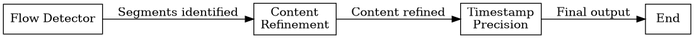

# Hello!! 
## In this repo, I have shared my approach to the problem statment mentioned in the link below. 
https://docs.google.com/document/d/155j76xypFp6qb0yjimDcO-FoFFw3gPVtl0tEAMxVHcM/edit?usp=sharing

## Steps to run :
## 1. Create a virtual environment in python and install the dependencies present in the requirements.txt file.
## 2. Install Graphviz, if on ubuntu then run :-  sudo apt-get install graphviz
## 3. To run the application from the cli type :- streamlit run main.py
## 4. Use the text present in the "output.txt" as input for the main.py program

### NOTE :-
### I have written a json_parser which does the heavy lifting and gives us a simple enough input for the program.
### The output of the json_parser is stored in "output.txt" file.

## Langgraph
### I have used Langgraph with an agentic workflow to solve it.
